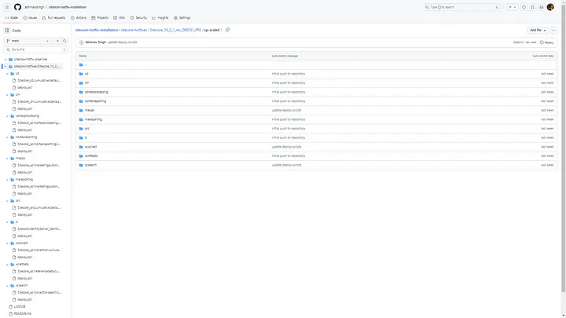
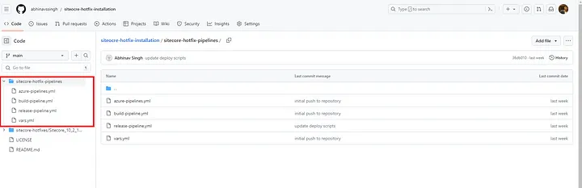
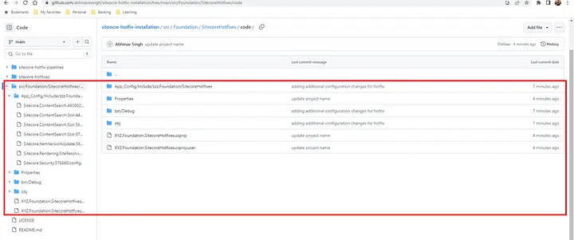

# sitecore-hotfix-installation
I have installed [Sitecore Cumulative Hotfixes](https://medium.com/@abhinavkumarsingh06/how-to-install-sitecore-hotfixes-on-paas-architecture-97b4cf6d7f8f) for 10.2.0 version. We can push hotfix package to existing repository, no need to create different repository. This way we will have single source of truth for code repository.

We have individual deploy.ps1 file for each role because each role has different parameter.

We can create pipeline for hotfixes also under main repository.

We can deploy additional configurations by adding Sitecore Hotfix project under Foundation layer if you are following Helix architecture. We need to replace XYZ by your project naming convention. This will be deployed by your main pipeline which is used to do for regular CI and CD.

